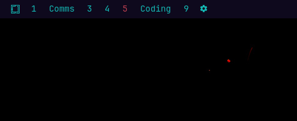

# Tile Manager

Named Hyprland workspaces with app assignments for the Omarchy Quattro bar.



The built-in `omarchy.workspaces` widget only shows numbers. Tile Manager names those spaces, parks apps on them, and takes you there when you launch an assigned app.

## Requirements

- Omarchy Quattro with the Quickshell plugin host
- Hyprland (the compositor Omarchy already runs)

No extra packages. The plugin runs inside the existing `omarchy-shell` process. It does not start a second Quickshell instance and does not need root.

## What it writes

| Path | Why |
|---|---|
| `~/.config/omarchy/tile-manager.json` | Your names and app assignments |
| `~/.local/state/omarchy/toggles/hypr/tile-manager.lua` | Generated window rules, loaded by Omarchy's existing Hyprland toggle directory |

It does **not** edit `~/.config/hypr/hyprland.lua`. It does **not** change your bar unless you turn on **Hide numbered workspaces** in the panel.

## Install

```sh
omarchy plugin add https://github.com/jethrojones/tile-manager.git --enable
```

For a local checkout:

```sh
omarchy plugin add ~/projects/tile-manager --enable
```

## Usage

- Used Hyprland workspaces appear in the bar automatically, in number order.
- The current workspace is outlined, underlined, and bold in the theme's active-window color.
- Click a name to switch to that workspace.
- Middle-click a name to launch its assigned apps.
- Right-click a name, or click the cog, to rename spaces and assign apps.
- **Assign focused window** pins the window you are on.
- **Assign open windows** parks each unique app on the workspace it is already using. Apps that roam, like terminals, are skipped.
- **Hide 1–0 workspace widget** is in Settings at the top of the cog panel, and is off by default.
- **Launch assigned apps at login** starts any assigned app that is not already running. Use **Launch assigned apps now** to do the same without logging out.
- Press Escape to close the panel.

Assigned apps open on their workspace through generated Hyprland window rules. **Follow launches** (on by default) also switches you there. If the app is already running, `omarchy-launch-or-focus` jumps to it.

## Remove

```sh
omarchy plugin remove io.github.jethrojones.tile-manager
```

Optional cleanup:

```sh
rm -f ~/.config/omarchy/tile-manager.json ~/.local/state/omarchy/toggles/hypr/tile-manager.lua
```

If you hid the numbered widget and want it back:

```sh
omarchy plugin enable omarchy.workspaces --section left
```

## License

MIT
